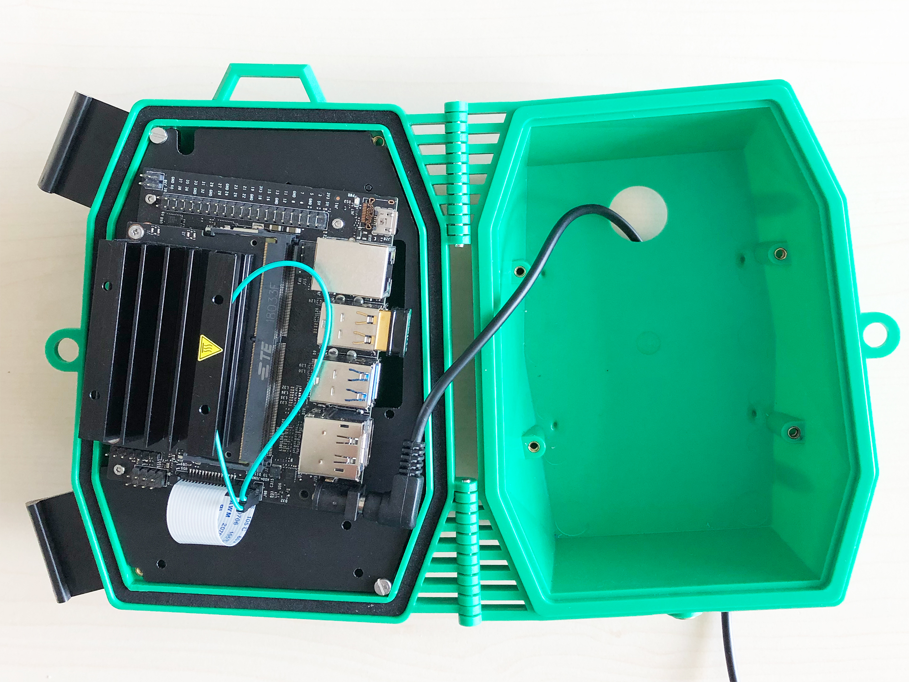
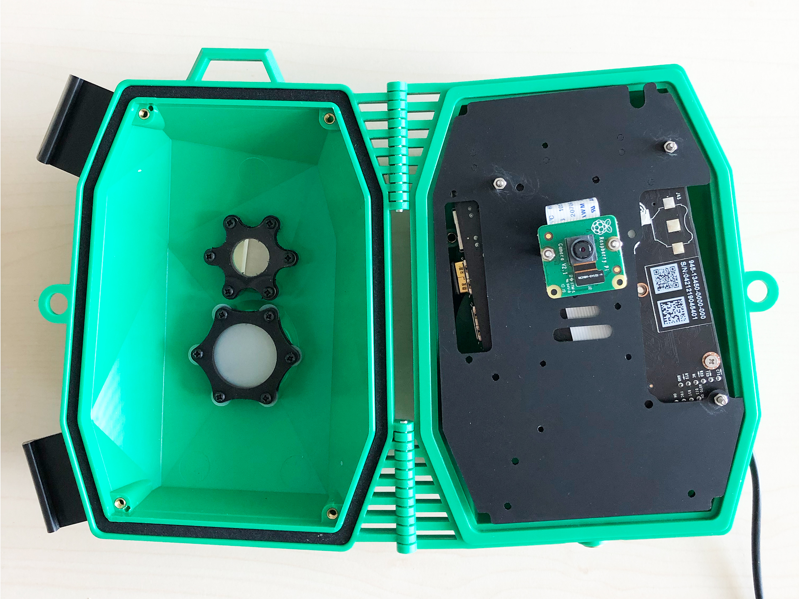
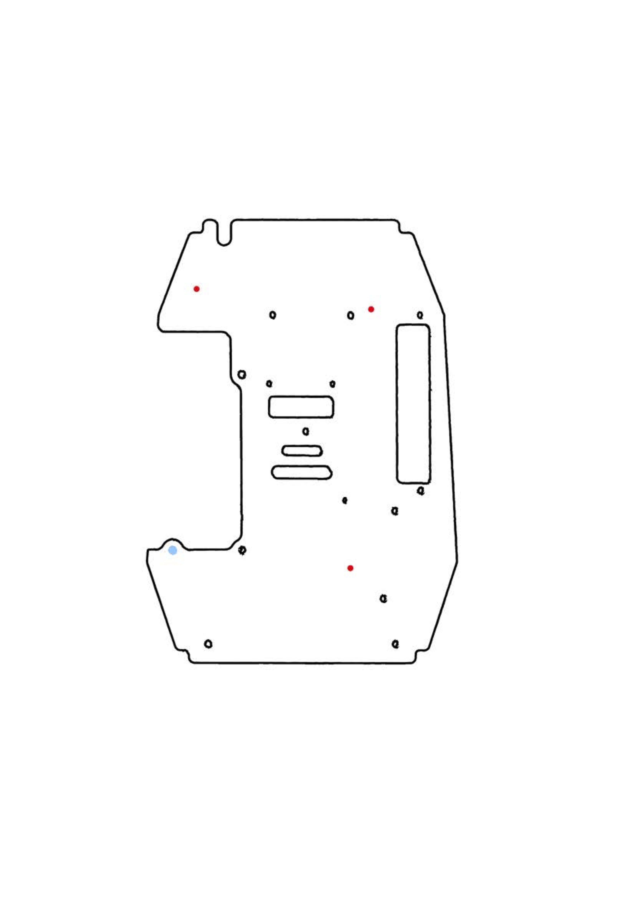
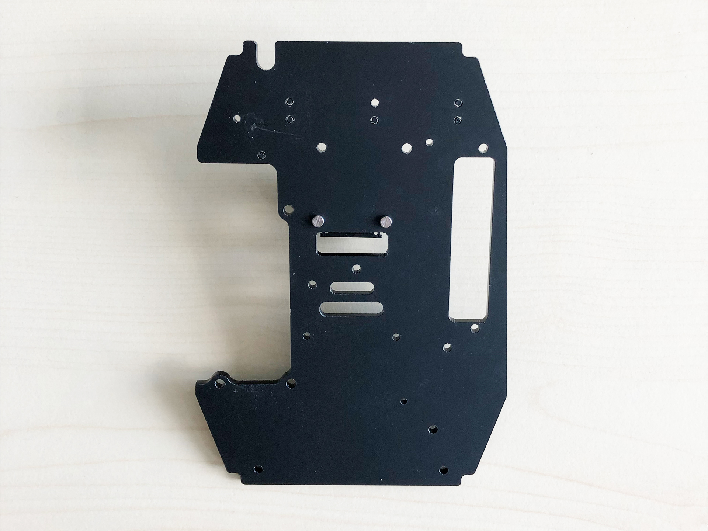
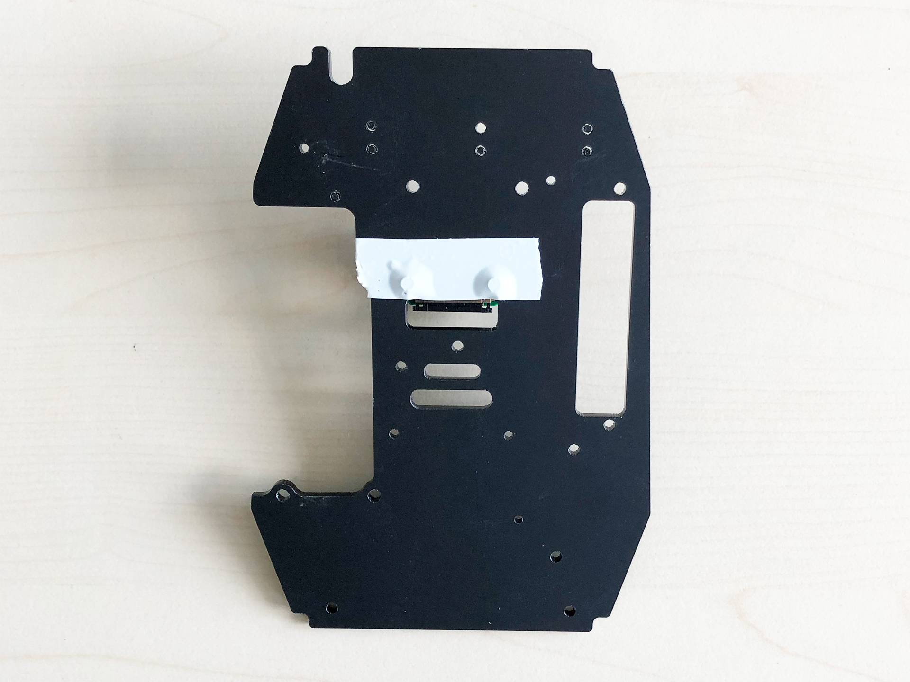
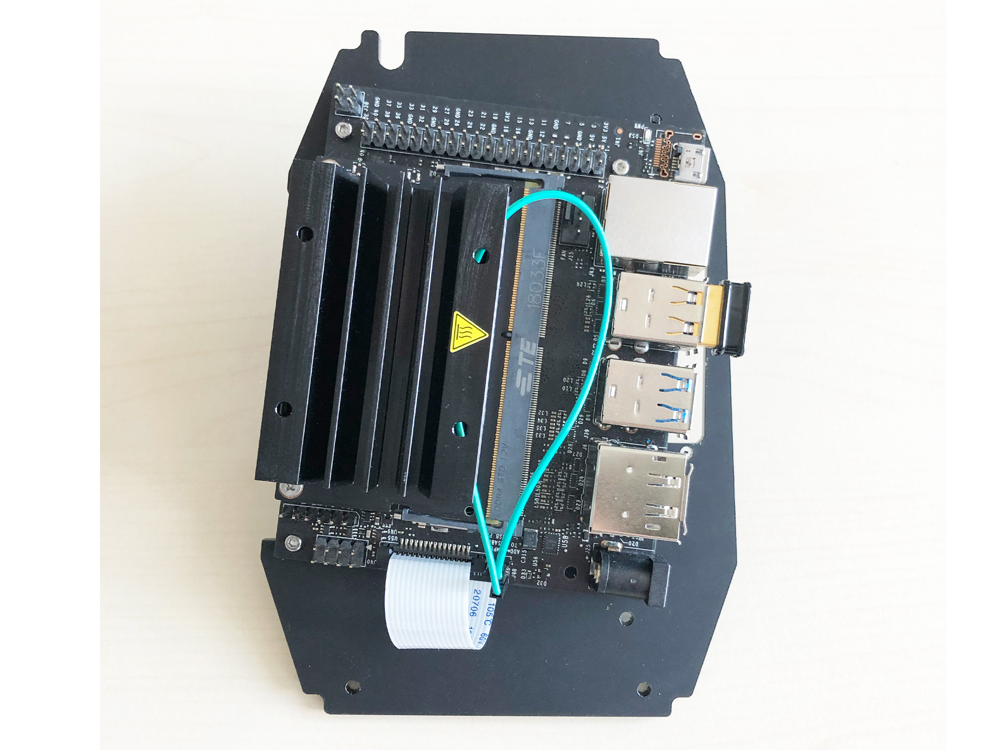
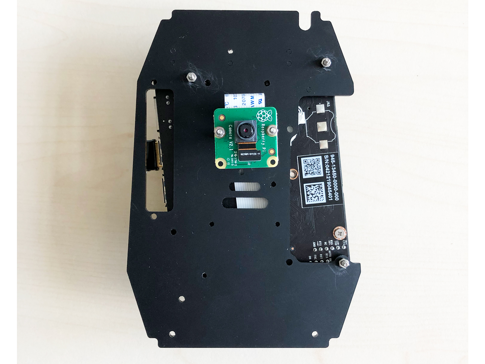
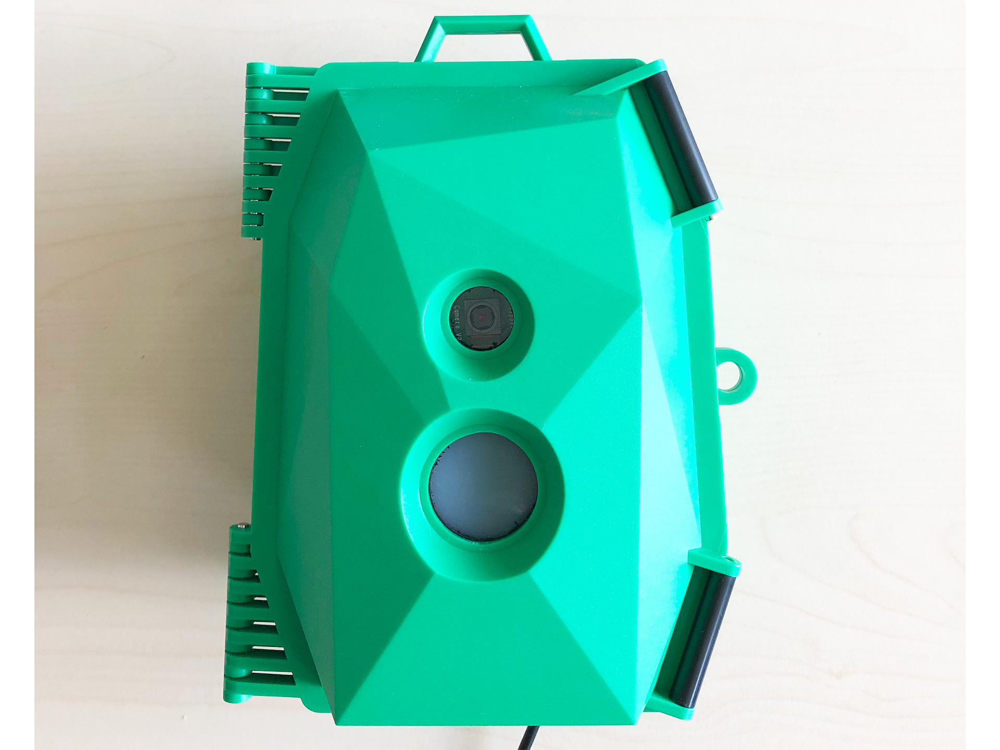
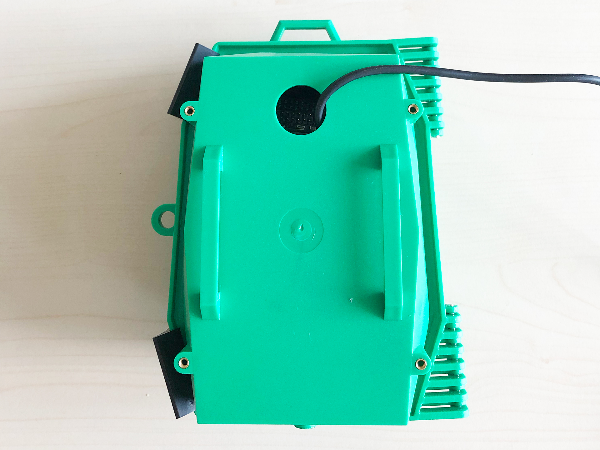

# Jetson Nano

## Limitations

Jetson Nano has two power mode, 5W and 10W.

Once Opendatacam is installed and **running without a monitor**, it runs perfectly fine on 5W powermode _(which is nice because you can power it with a powerbank)_. If you use it with a monitor connected, the display will be a bit laggy but it should work.

We recommend you to do the setup with a monitor connected and then make your Jetson nano available as a Wifi hotspot to operate it from another device.

The 10W Power mode of the Jetson won't bring much performance improvement for Opendatacam.

:::info
For the 2GB Jetson Nano, it **must be installed and running without a monitor**!
Otherwise the system will run out of RAM and OpenDataCam will not start.
:::

## Shopping list

The minimum setup for 5W power mode is:

- 1 Jetson nano
- 1 Camera [USB compatible camera](https://elinux.org/Jetson_Nano#Cameras) or [Raspberrycam module v2](https://www.raspberrypi.org/products/camera-module-v2/)
- 1 Wifi dongle, [this one is compatible](https://www.edimax.com/edimax/merchandise/merchandise_detail/data/edimax/in/wireless_adapters_n150/ew-7811un/) out of the box, or [see compatibility list](https://elinux.org/Jetson_Nano#Wireless).
- 1 MicroSD card (at least 32 GB and 100 MB/s)
- 1 Power supply: either a [5V⎓2A Micro-USB adapter](https://www.adafruit.com/product/1995) or a Powerbank with min 2A output.

For 10W power mode _(this is good for desktop use when you plug the screen, the mouse, the keyboard, it draws powers from the peripherics)_

- Power supply: [5V⎓4A DC barrel jack adapter, 5.5mm OD x 2.1mm ID x 9.5mm length, center-positive](https://www.adafruit.com/product/1466)
- 1x [2.54mm Standard Computer Jumper](https://www.amazon.com/2-54mm-Standard-Computer-Jumper-100pack/dp/B00N552DWK/) This is used on the J48 Pin when supplying power from the jack entry instead of the microUSB. It tells the Jetson to by-pass the microUSB power entry.

For setup:

- 1 usb mouse
- 1 usb keyboard
- 1 screen (HDMI or Displayport)
- And for faster connexion, a ethernet cable to your router

Learn more about Jetson Nano ecosystem: [https://elinux.org/Jetson_Nano#Ecosystem_Products_and_Sensors](https://elinux.org/Jetson_Nano#Ecosystem_Products_and_Sensors)

## Setup Opendatacam

### 1. Flash Jetson Nano:

Follow [Flashing guide](FLASH_JETSON.md#Jetson-Nano) (don't forget to verify if CUDA is in your PATH)

### 2. Set correct Powermode according to your Power supply

#### Using microUSB

Using microUSD with a powerbank or a 5V⎓2A power supply, you just need to plug-in and the Jetson Nano will start when connected to it.

When started, we advise you to set the powermode of the Jetson Nano to 5W so it won't crash, to do so, open a terminal and run:

```
sudo nvpmodel -m 1
```

To switch back to 10W power mode (default)

```
sudo nvpmodel -m 0
```

#### Using barrel jack (5V - 4A)

When working with the Jetson Nano with the monitor connected, we advise to use the barrel jack power. In order to do so you need first to put a jumper on the J48 pin (more details on Jetson Nano power supply)


By default, the Jetson Nano will already run on the 10W power mode, but you can make sure it is by running:

```
sudo nvpmodel -m 0
```

### 3. Setup a swap partition (Optional)

In order to reduce memory pressure (and crashes), it is a good idea to setup a 6GB swap partition. _(Nano has only 4GB of RAM)_

```bash
git clone https://github.com/JetsonHacksNano/installSwapfile
cd installSwapfile
chmod 777 installSwapfile.sh
./installSwapfile.sh
```

Reboot the Jetson nano

### 4. Install Opendatacam

You need to install [Docker compose](https://blog.hypriot.com/post/nvidia-jetson-nano-install-docker-compose/) (no official installer available for ARM64 devices)

```bash
sudo apt install python3-pip

sudo apt-get install -y libffi-dev
sudo apt-get install -y python-openssl
sudo apt-get install -y libssl-dev

sudo -H pip3 install --upgrade pip
sudo -H pip3 install docker-compose
```

And then install OpenDataCam

```bash
# Download install script
wget -N https://raw.githubusercontent.com/opendatacam/opendatacam/v3.0.2/docker/install-opendatacam.sh

# Give exec permission
chmod 777 install-opendatacam.sh

# NB: You will be asked for sudo password when installing the docker container

# Install command for Jetson Nano
./install-opendatacam.sh --platform nano
```

### 5. Run on USB Camera (Optional)

By default, OpenDataCam will start on a demo file, but if you want to run from an usbcam you should

- Verify an USB Camera is connected

```bash
ls /dev/video*
# Output should be: /dev/video1
```

- Change `"VIDEO_INPUT"` in `config.json`

```json
"VIDEO_INPUT": "usbcam"
```

- Change `"usbcam"` device in `config.json` depending on the result of `ls /dev/video*`

For example:

```json
"v4l2src device=/dev/video1 ..."
```

- Restart docker

```
sudo docker-compose restart
```

_N.B : there is some issue to support out of the box (docker install) run from the CSI cam (raspberry pi cam), please see: https://github.com/opendatacam/opendatacam/blob/master/documentation/CONFIG.md#run-from-raspberry-pi-cam-jetson-nano for more info, you need to do a manual install for this_

### 6. Test Opendatacam

Open `http://localhost:8080`.

This will be super slow if you are using this directly on the monitor connected to the Jetson nano, see next step to access Opendatacam from an external device.

### 7. Access Opendatacam via Wifi hotspot (Optional)

:::note
You need a wifi dongle for this.
:::

In situations where the Jetson is deployed in the field it may come in handy to be able to connect to the device directly without the need to bring an extra Ethernet Cable or WiFi Access Point.
To do so, Jetson can be configured to be a WiFi hotspot of it's own that your Laptop or Phone can connect to the device directly.

#### On Ubuntu 18.04 via UI

##### 1. Open network manager


##### 2. Create a wifi connection


##### 3. Configure as a hotspot

You can name the wifi as you like, and you need to select "Hotspot" for the Mode.


##### 3.a Set a wifi password (optional)

In the Wi-fi security tab, you can setup an password to protect your jetson from being accessed by others.

##### 4. Set auto-connect

In the "General" tab, you need to check "Automatically connect to this network when it is available" so it will start the wifi hotspot on boot.


##### 5. Reboot

After rebooting your device, you should be able to connect it via the wifi hotspot and access OpenDataCam if started.

##### 6. Get IP adress of Wifi hotpot

Click on the network icon on the top right > Connection Information


#### Via command line

This was tested on the Jetson Nano Developer Kit SD Card Image (JP 4.4 released on 2020/07/07).
But it should work on any Linux distribution with [NetworkManager](https://en.wikipedia.org/wiki/NetworkManager) and [`nmcli`](https://developer.gnome.org/NetworkManager/stable/nmcli.html) installed.

To create an hotspot or ad-hoc WiFi network execute the following command

```bash
nmcli device wifi hotspot ifname wlan0 ssid <SSID> password <PASS>
```

This will create a hotspot with SSID `<SSID>`.
The hotspot will remain available until the device reboots or the hotspot is closed manually.
If the hotspot should be automatically created on boot execute the following command after creating the hotspot

```bash
nmcli con modify Hotspot connection.autoconnect true
```

#### ⁉️ Troubleshooting

1.Wifi-Hotspot doesn't show up on other devices
--> go to /etc/modprobe.d/bcmdhd.conf and add the line: options bcmdhd op_mode=2
--> reboot your device

### 8. Build a case (Optional)

**Here are the steps to set up the Jetson NANO in the [Wildlife Cam Casing from Naturebytes](http://naturebytes.org/our-tech/).**


The casing is originally designed for the raspberry pi 3. The good thing is, that the form-factor of the nano board is not that different so with some simple modifications of the base plate, the Jetson board will fit in without any problems.

| Nano side                         | Cam side                         |
| --------------------------------- | -------------------------------- |
|  |  |

#### Steps

##### One way to fit the board on the baseplate is

- Print out the PDF file with the baseplate template
- Attach the print on the baseplate
- Drill the holes marked in red on the template (preferably with an 3mm bit since the screws used are M3s)

##### Another way is

- Fix it with one thread screw on the existing hole (marked in blue in the baseplate template below)
- Rotate the board to the point where it fits perfectly on the baseplate.
- Mark your own holes in the locations (also marked in red in the baseplate template below).
- Once it fits, mark the spots for the hole and drill it with an electric drill (preferably with an 3mm bit since the screws used are M3s)

Make sure to leave some space for the power adapter since it takes a bit of space. ([Link to the adapter](https://www.amazon.de/gp/product/B004US2XPS/ref=ppx_yo_dt_b_asin_title_o02_s00?ie=UTF8&psc=1))

| Baseplate                                  | Print version                                 |
| ------------------------------------------ | --------------------------------------------- |
|  | [Baseplate PDF](./assets/nano_baseplate.pdf) |

- When installing the RaspiCam make sure to cover the screws with some electrical tape to prevent short circuits since the board will be mounted on the other side of the plate.

|                            |                           |
| -------------------------- | ------------------------- |
|  |  |

- After mounting the camera on the board you can place the board on the plate and fix it there with 4 thread screws (3mm) as seen on the pictures below

|                           |                          |
| ------------------------- | ------------------------ |
|  |  |

- The last step is to fix the baseplate on the casing with the included screws.


#### Congrats you are finshed

|                           |                          |
| ------------------------- | ------------------------ |
|  |  |

## Tips

- You'll notice there are no button to power on / off button your Jetson Nano. When you plug the power supply it will power on immediately. If you want to restart you can just un-plug / re-plug if you are not connected via a Monitor or SSH. There is a way to add power buttons via the J40 pins, [see nvidia forum](https://devtalk.nvidia.com/default/topic/1050888/jetson-nano/power-and-suspend-buttons-for-jetson-nano/post/5333577/#5333577).
- To control your Jetson device in Headless mode, you can SSH into the machine using `ssh <username>@<hostname>.local` where `<username>` and `<hostname>` are the values chosing during headless install. (e.g. `ssh me@my-jetson.local`)
